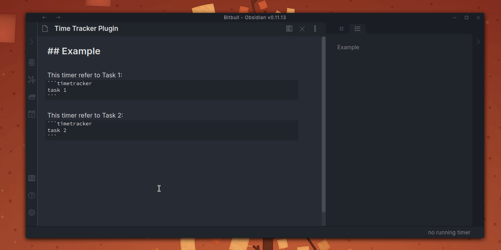
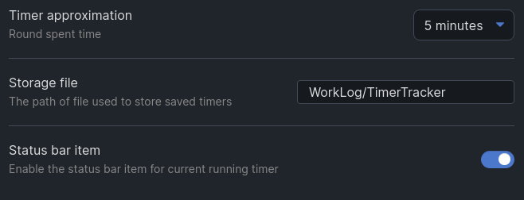
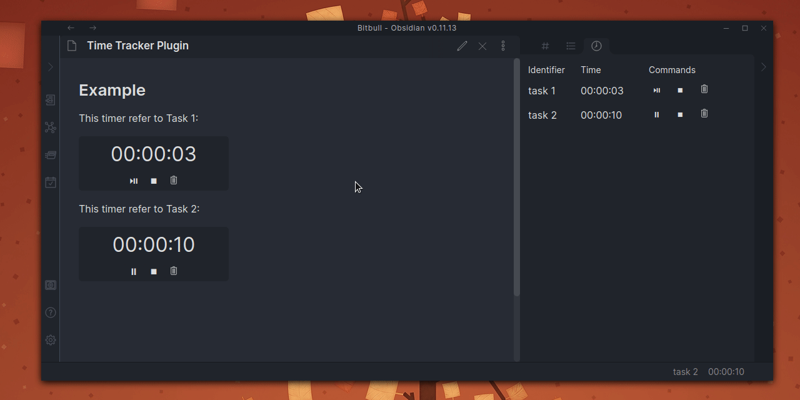
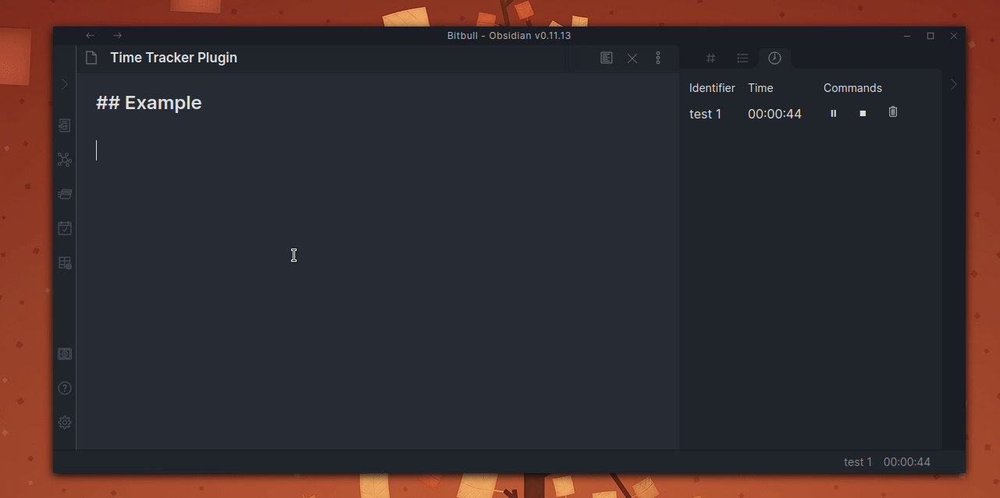
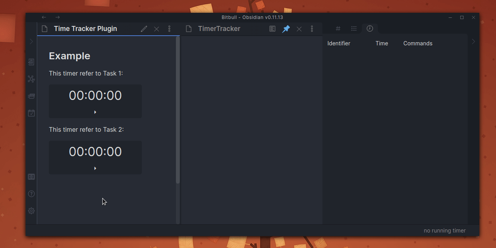
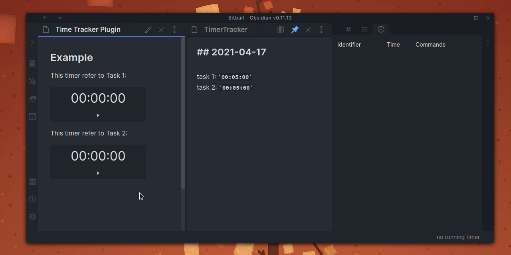

# Obsidian Timer Tracker Plugin

An [Obsidian.md](https://obsidian.md/) plugin that help to keep track of time spent on different tasks.

## Installation

Download zip archive from [GitHub releases page](https://github.com/daaru00/obsidian-time-tracker/releases) and extract it into `<vault>/.obsidian/plugins` directory.

## Usage

Add this code block where you want to show the timer widget:
````makrdown
```timetracker
example-identifier
```
````

Interact with timers, start, pause, resume, delete:



## Configurations

When a timer is saved the tracked amount of time can be approximated to the closest 5/10/15 minute, this configuration can be changed in settings page.



## Commands

You can also use commands to interact with timer in the same way as the UI:



Also creating a new timer (will also pause other running timers):



## Saving

When you use the stop action for a timer it will be deleted from the list of timers and saved into a configurable "storage file":



The plugin will create an title header for each day:



## Compatible Plugins

This plugin is compatible with [Jira Issue](https://github.com/daaru00/obsidian-jira-issue) and [Redmine Issue](https://github.com/daaru00/obsidian-redmine-issue) widgets.

With these plugins you will be able to save timers to a remote system like Redmine or Jira.
